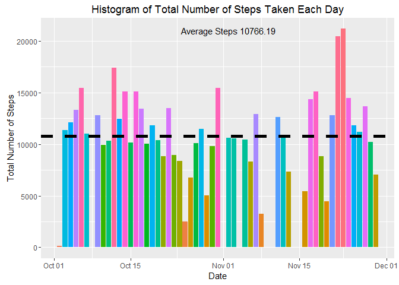
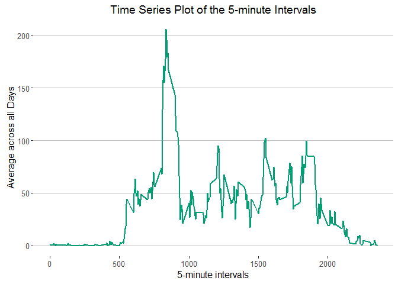
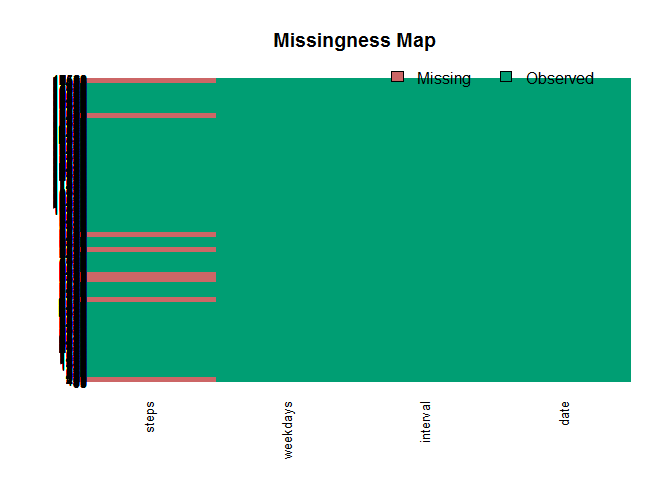
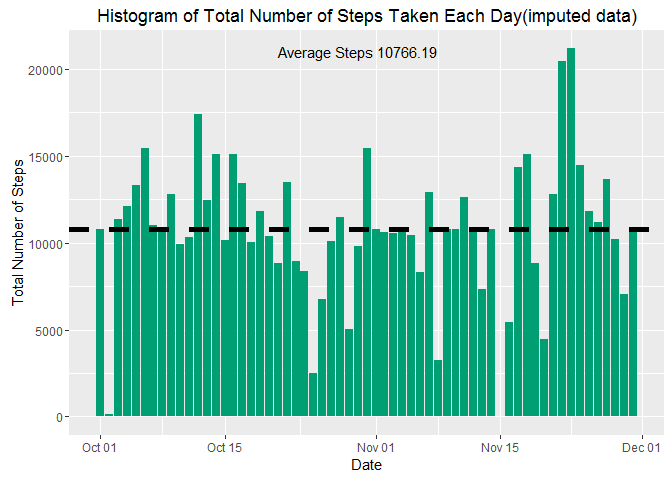
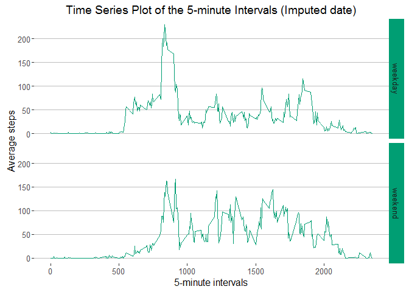

# Reproducible Research: Peer Assessment 1

## The dataset

The variables included in this dataset are:

* steps: Number of steps taking in a 5-minute interval (missing values are coded as NA)
* date: The date on which the measurement was taken in YYYY-MM-DD format
* interval: Identifier for the 5-minute interval in which measurement was taken

The dataset is stored in a comma-separated-value (CSV) file and there are a total of 17,568 observations in this dataset.


## Loading and preprocessing the data


```r
## loading the required libraries
library(ggplot2) ## used for ploting our data
library(Amelia) ## for missingness map
library(ggthemes) ## themes for ggplot

## I have already downloaded the file in my directory

## Unzipping the file in the current working directory
unzip(zipfile = "activity.zip", exdir = getwd())
## reading the dataset
activity.data <- read.csv( file = "activity.csv" ,sep = ",")   

## transforming date colmuns from Factor to Date
activity.data$date <- as.Date(activity.data$date, "%Y-%m-%d")


## adding a factor column called weekdays
## we need this culmn to be used later in the final step of our analysis(after imputing missing values)
activity.data$weekdays <- factor(format(activity.data$date, "%A"))


# Computing the day type (weekend or weekday)
levels(activity.data$weekdays) <- list(weekday = c("Monday", "Tuesday",
                                             "Wednesday", 
                                             "Thursday", "Friday"),
                                 weekend = c("Saturday", "Sunday"))
```

Lets look how our data looks


```r
## The first 6 rows of our data
head(activity.data)
```

```
##   steps       date interval weekdays
## 1    NA 2012-10-01        0  weekday
## 2    NA 2012-10-01        5  weekday
## 3    NA 2012-10-01       10  weekday
## 4    NA 2012-10-01       15  weekday
## 5    NA 2012-10-01       20  weekday
## 6    NA 2012-10-01       25  weekday
```

```r
## Our data structure
str(activity.data)
```

```
## 'data.frame':	17568 obs. of  4 variables:
##  $ steps   : int  NA NA NA NA NA NA NA NA NA NA ...
##  $ date    : Date, format: "2012-10-01" "2012-10-01" ...
##  $ interval: int  0 5 10 15 20 25 30 35 40 45 ...
##  $ weekdays: Factor w/ 2 levels "weekday","weekend": 1 1 1 1 1 1 1 1 1 1 ...
```

```r
## Summary of our data
summary(activity.data)
```

```
##      steps             date               interval         weekdays    
##  Min.   :  0.00   Min.   :2012-10-01   Min.   :   0.0   weekday:12960  
##  1st Qu.:  0.00   1st Qu.:2012-10-16   1st Qu.: 588.8   weekend: 4608  
##  Median :  0.00   Median :2012-10-31   Median :1177.5                  
##  Mean   : 37.38   Mean   :2012-10-31   Mean   :1177.5                  
##  3rd Qu.: 12.00   3rd Qu.:2012-11-15   3rd Qu.:1766.2                  
##  Max.   :806.00   Max.   :2012-11-30   Max.   :2355.0                  
##  NA's   :2304
```


## What is mean total number of steps taken per day?

We see in our data summary that there are  2304 data missing`(NA)`. For this step we will ignore the missing values(a valid assumption), and proceed by calculating the total steps per day.


```r
# Compute the total number of steps each day
activity.steps.day <- aggregate(steps ~ date, data = activity.data, sum)
```
Let's have a look of our aggregated data (number of steps per day)

```r
head(activity.steps.day)
```

```
##         date steps
## 1 2012-10-02   126
## 2 2012-10-03 11352
## 3 2012-10-04 12116
## 4 2012-10-05 13294
## 5 2012-10-06 15420
## 6 2012-10-07 11015
```

Here is the mean total number of steps.


```r
## using mean() functionn to calulate the mean of steps for all days
mean.steps <- mean(activity.steps.day$steps)
mean.steps
```

```
## [1] 10766.19
```
 and here is the median

```r
## using median() functionn to calulate the median of steps for all days
median.steps <- median(activity.steps.day$steps)
median.steps
```

```
## [1] 10765
```


Let's now make a histogram of the total number of steps taken per day. I will use `ggplot2` pakage to make the plot.


```r
## Make a histogram of the total number of steps taken each day

## setting data to be plotted
p1 <- ggplot(activity.steps.day, aes(date, steps, fill = interaction(date, steps)))
## making thed bars
p1 <- p1 +  geom_bar(stat = "identity")
## making a line for mean of steps
p1 <- p1 +  geom_hline(aes(yintercept=mean.steps ), color="#000000", linetype="dashed", size=2)
## seeting the theme (removing legend from graph)
p1 <- p1 +theme(legend.position="non")
## make annotation of avreage steps value
p1 <- p1 + annotate("text", y = 21000,x = activity.steps.day$date[30],
                                  color = "#000000", size = 4 , label =  "Average Steps 10766.19")
## adding labels to the graph
p1 <- p1 + labs(title = "Histogram of Total Number of Steps Taken Each Day",
                      x = "Date", y = "Total Number of Steps")

print(p1)
```




## What is the average daily activity pattern?

For this step we will aggregat (based on average of steps)our activity data of steps by intervals of 5-minutes save them in a data frame called `avg.steps.intrv`.


```r
avg.steps.intrv <- aggregate(steps ~ interval, data = activity.data, mean)
```

Let's have a look of our aggregated data (number of steps per day)

```r
head(avg.steps.intrv)
```

```
##   interval     steps
## 1        0 1.7169811
## 2        5 0.3396226
## 3       10 0.1320755
## 4       15 0.1509434
## 5       20 0.0754717
## 6       25 2.0943396
```

Now we will make a plot with the time series of the average number of steps taken (averaged across all days) versus the 5-minute intervals:


```r
## setting data to be plotted
p2 <- ggplot(avg.steps.intrv, aes(interval, steps))
## making thed line of our serais
p2 <- p2 +  geom_line(color = "#009E73", size = 1)
## seeting the theme using `ggthemes` pakage
p2 <- p2 +theme_hc(bgcolor = "kunica")
## adding labels to the graph
p2 <- p2 +  labs(title = "Time Series Plot of the 5-minute Intervals",
       x = "5-minute intervals", y = "Average across all Days")

print(p2)
```



Now we will look at the  5-minute interval, on average across all days, that contains the most steps


```r
avg.steps.intrv[avg.steps.intrv$steps == max(avg.steps.intrv$steps),]
```

```
##     interval    steps
## 104      835 206.1698
```


## Imputing missing values

We noted from our previous summary of our activity data that there are a number of missing values (coded as `NA`). The presence of missing days may introduce bias into some calculations or summaries of the data.

Let's take a big picture of we are the missing values located in our data. I will use the function `missmap()` from the package `Amelia`


```r
missmap(activity.data, col = c("#CC6666","#009E73"))
```



Let's again calculate and report the total number of missing values in the dataset (i.e. the total number of rows with NAs)


```r
sum(is.na(activity.data))
```

```
## [1] 2304
```
To populate missing values, *we choose to replace them with the mean values at the same interval across days*. In most of the cases the median is a better centrality measure than mean, but in our case the total median is not much far away from total mean, and probably we can make the mean and median meets.


I'll save the imputed data in a new data fame called `imputed.data`


```r
imputed.data <- activity.data 
for (i in 1:nrow(imputed.data)) {
    if (is.na(imputed.data$steps[i])) {
        imputed.data$steps[i] <- avg.steps.intrv[which(imputed.data$interval[i] == avg.steps.intrv$interval), ]$steps
    }
}
```

Here is a proof that all missing values have been filled in.


```r
sum(is.na(imputed.data))
```

```
## [1] 0
```

Let's compare the mean and median of our imputed data with previous analysis. 
First we will calculat the total steps per day of  `imputed.data`


```r
activity.steps.day.imput <- aggregate(steps ~ date, data = imputed.data, sum)
```
let's look at it's mean and median


```r
mean.steps.imp <- mean(activity.steps.day.imput$steps)
mean.steps.imp
```

```
## [1] 10766.19
```

```r
median.steps.imp <- median(activity.steps.day.imput$steps)
median.steps.imp
```

```
## [1] 10766.19
```
Comparing means and medians reveals that both new means are the same while the new median is greater than the old median. The impact of imputing the missing values is to have more data, hence to obtain a bigger median value.


let's make a histogram of the total number of steps taken each day for our new data


```r
imputed.data$date <- as.Date(imputed.data$date, "%Y-%m-%d")

p3 <- ggplot(imputed.data, aes(date, steps)) 
p3 <- p3 + geom_bar(stat = "identity", fill = "#009E73")
p3 <- p3 + geom_hline(aes(yintercept=mean.steps.imp ), color="#000000", linetype="dashed", size=2)
p3 <- p3 + theme(legend.position="non")
p3 <- p3 + annotate("text", y = 21000, x = activity.steps.day.imput$date[30],
                    color = "#000000", size = 4 , label =  "Average Steps 10766.19") 
p3 <- p3 + labs(title = "Histogram of Total Number of Steps Taken Each Day(imputed data)",
                  x = "Date", y = "Total Number of Steps")
       
print(p3)
```




## Are there differences in activity patterns between weekdays and weekends?
 
Remember we previously created new factor variable in the dataset with two levels -- "weekday" and "weekend" indicating whether a given date is a weekday or weekend day.

Firts, I'll aggregate the new data `impudet.data` based on the average numbers of steps taken on weekdays *weekday* or *weekend* days by 5-minute interval and I'll save it in a data fame variable called `avg.steps.intrv.wkdays`


```r
avg.steps.intrv.wkdays <- aggregate(steps ~ interval + weekdays , data = imputed.data, mean)
```

Now I will make a panel plot containing a time series plot of the 5-minute interval (x-axis) and the average number of steps taken, averaged across all weekday days or weekend days (y-axis).


```r
## setting data to be plotted
p4 <- ggplot(data = avg.steps.intrv.wkdays, aes(interval, steps)) 
## making facet grid plot
p4 <- p4 +  facet_grid(weekdays~.)
## seeting the strip background color
p4 <- p4 + theme(strip.background = element_rect(fill = "#009E73"))
## seeting the theme using `ggthemes` pakage
p4 <- p4 + theme_hc(bgcolor = "kunica")
## making thed line of our serais
p4 <- p4 + geom_line(color = "#009E73",size =.6)

p4 <- p4 + labs(title = "Time Series Plot of the 5-minute Intervals (Imputed date)",
                x = "5-minute intervals", y = "Average steps")
print(p4)
```



From the graphe we can see that greatest peak from all steps intervals are on weekdays . Also, we can see that weekends activities has more peaks over a *hundred* than weekdays. This might be due to the repetitive work routine activities on weekdays. On the weekend however, we can see better distribution of effort along the time.
